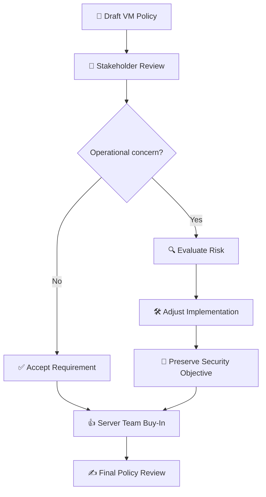

# 🔐 Vulnerability Management Policy & Stakeholder Buy-In

### 🌿 Juniper Rabbit Labs

> **Meeting:** Vulnerability Management Policy — Server Team Buy-In  
> **Scenario:** Stakeholder Review of the Draft Vulnerability Management Policy  
> **Environment:** Juniper Rabbit Labs  
> **Role:** Katy - Vulnerability Management Analyst  
> **Stakeholder:** Mike — Server Team Manager  
> **Objective:** Review the proposed Vulnerability Management Policy and obtain
> operational feedback before final approval

---

## 📋 Overview

As part of implementing a vulnerability management program, an initial Vulnerability Management Policy was developed to establish expectations for vulnerability scanning, remediation, system maintenance, and organizational responsibilities.

Before moving the policy forward for final approval, the proposed requirements were reviewed with the Server Team.

The goal of the meeting was to identify operational concerns, gather feedback from the team responsible for many of the affected systems, and determine whether changes were needed before requesting final policy approval.

---

## 🎯 The Challenge

The initial Vulnerability Management Policy required **monthly vulnerability scanning of organizational IT assets**, along with additional ad-hoc scanning when significant security threats or newly disclosed vulnerabilities warranted further assessment.

During stakeholder review, the Server Team raised concerns about vulnerability scans being performed against production systems without coordination.

Production servers may support business-critical workloads, and unexpected scanning during periods of high activity could introduce unnecessary operational risk.

The challenge was therefore to:

> **Preserve the organization's vulnerability scanning requirements while creating a process that accounted for production availability and system ownership.**

---

## 💬 Stakeholder Discussion

### 👩‍💻 Katy — Vulnerability Management Analyst

> Thanks for taking some time to review the Vulnerability Management Policy, Mike. Before we finalize anything, I wanted to make sure the Server Team has a chance to flag anything that could create problems in practice.

### 🖥️ Mike — Server Team Manager

> Most of it looks reasonable. My biggest concern is the monthly scanning requirement. We have several production systems where unexpected scanning could create problems, especially during month-end processing and other high-volume periods.

### 👩‍💻 Katy — Vulnerability Management Analyst

> That's good to know. I definitely don't want the vulnerability program interfering with production. Would having an established scanning window make the requirement easier for your team?

### 🖥️ Mike — Server Team Manager

> Yes. If we knew when authenticated scans were happening, we could avoid our busiest periods and make sure someone from the team was available if anything unexpected happened.

### 👩‍💻 Katy — Vulnerability Management Analyst

> That makes sense. What if we keep the monthly scanning requirement, but coordinate the scan window with the asset owner ahead of time? We could also document systems that have specific operational restrictions so they're accounted for when scans are scheduled.

### 🖥️ Mike — Server Team Manager

> I'd be comfortable with that. I'd also like some notice before an ad-hoc scan. The policy currently allows those when new vulnerabilities are announced, which I understand, but I'd rather not have an unexpected scan hit a production server.

### 👩‍💻 Katy — Vulnerability Management Analyst

> Agreed. We can add notification to the process. For normal ad-hoc scanning, the Server Team would be contacted before the scan begins.
>
> For an urgent security situation, we may need to move faster, but we'd still establish a communication channel with the system owner rather than scanning production systems without coordination.

### 🖥️ Mike — Server Team Manager

> That's much better. My concern isn't really the security scanning itself—it's having changes or activity happen against production systems without the team knowing about it.

### 👩‍💻 Katy — Vulnerability Management Analyst

> And that's exactly the kind of issue I wanted to identify before the policy was finalized. I'll update the process to require coordination with asset owners for scheduled scans and establish a notification process for ad-hoc scans.

### 🖥️ Mike — Server Team Manager

> In that case, I'm comfortable with the scanning requirements.

### 👩‍💻 Katy — Vulnerability Management Analyst

> Great. One other thing I'd like from your team is help maintaining accurate ownership information for the servers. When Tenable identifies something, we need to know who actually owns the affected asset so the finding gets to the right person.

### 🖥️ Mike — Server Team Manager

> That's fair. We can provide the server inventory and identify the appropriate owners. We'll just need a process for updating it as systems are added or retired.

### 👩‍💻 Katy — Vulnerability Management Analyst

> Perfect. We'll include asset ownership review as part of the vulnerability management process rather than treating the inventory as something we create once and forget about.

### 🖥️ Mike — Server Team Manager

> That works for me. With those changes, the Server Team can support the policy.

### 👩‍💻 Katy — Vulnerability Management Analyst

> Excellent. I'll document the changes and send the revised version back for review before it moves forward for approval.

---

## 🤝 Policy Negotiation

| Initial Requirement              | Stakeholder Concern                                                               | Agreed Approach                                                                      |
| :------------------------------- | :-------------------------------------------------------------------------------- | :----------------------------------------------------------------------------------- |
| Monthly vulnerability scans      | Uncoordinated scans could interfere with production workloads                     | Coordinate production scanning windows with asset owners                             |
| Ad-hoc vulnerability scans       | Unexpected scanning could occur against production systems                        | Provide advance notification when circumstances permit                               |
| Organization-wide asset coverage | Vulnerability Management may not always have current system ownership information | Server Team assists with maintaining accurate asset ownership                        |
| Urgent vulnerability assessment  | Security events may require rapid assessment                                      | Accelerated scanning is permitted while maintaining communication with system owners |

---

## 🔄 Stakeholder Buy-In Process

## 📝 Agreed Policy Changes

Following the stakeholder discussion, the following changes were proposed:

- [x] Maintain monthly vulnerability scanning
- [x] Coordinate production scanning windows with asset owners
- [x] Provide advance notification for routine ad-hoc scanning when circumstances permit
- [x] Maintain communication with system owners during urgent security assessments
- [x] Document ownership information for server assets
- [x] Periodically review asset ownership as systems are added, modified, or retired

---

## ✅ Meeting Outcome

> [!IMPORTANT]
> **Server Team Buy-In: Obtained**

The Server Team agreed to support the Vulnerability Management Policy after operational concerns surrounding production scanning and asset ownership were addressed.

The resulting approach maintains the security objectives of the vulnerability management program while introducing coordination procedures designed to reduce unnecessary operational risk.

---

## 🧠 Skills Demonstrated

`Vulnerability Management` `Stakeholder Management` `Security Policy` `Tenable` `Risk Management` `Asset Management` `Security Operations`

---

## 💡 Key Takeaway

Vulnerability management involves more than identifying technical vulnerabilities.

Security teams must work with the owners of affected systems to ensure that scanning and remediation requirements can be implemented without unnecessarily disrupting business operations.

In this scenario, stakeholder feedback did not eliminate the organization's security requirements. Instead, collaboration resulted in a more practical process for implementing those requirements while maintaining accountability and visibility between Vulnerability Management and the Server Team.

---

## ➡️ Next Step

With Server Team buy-in obtained, the proposed changes can be incorporated into the Vulnerability Management Policy before the policy moves forward for final review and approval.

**Next Phase:** `Vulnerability Management Policy — Final Review & Sign-Off`

---

_This project uses a simulated organizational environment to demonstrate the implementation of a vulnerability management program. Names, conversations, and organizational scenarios presented in this portfolio artifact are fictional and created for educational purposes._
