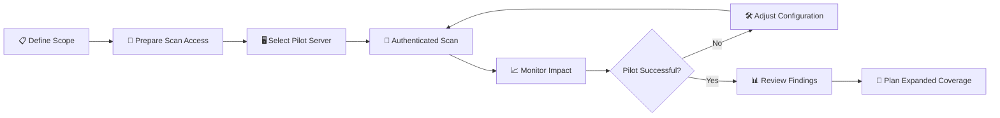

# 🔎 Initial Vulnerability Scan | Server Team Meeting

### 🌿🐇 Juniper Rabbit Labs

> **Meeting:** Initial Vulnerability Scan — Server Team Coordination  
> **Scenario:** Planning the Initial Authenticated Vulnerability Scan  
> **Environment:** Juniper Rabbit Labs  
> **Role:** Katy - Vulnerability Management Analyst  
> **Stakeholder:** Mike — Server Team Manager  
> **Objective:** Confirm scan scope, access requirements, operational safeguards, and pilot approach before beginning authenticated vulnerability scanning

---

## 📋 Meeting Context

With the Vulnerability Management Policy approved, Juniper Rabbit Labs is preparing to begin its first vulnerability assessment cycle.

Before configuring the initial Tenable scan, Vulnerability Management met with the Server Team to review the proposed scan scope, credential requirements, operational considerations, and rollout strategy.

> [!IMPORTANT]
> **No production scanning will begin until the scan scope, access method, and operational safeguards have been reviewed with the asset owner.**

---

## 💬 Stakeholder Discussion

### 👩‍💻 Katy — Vulnerability Management Analyst

> Thanks for meeting again, Mike. Now that the vulnerability management policy has been approved, I'd like to start planning our initial assessment.
>
> Rather than immediately scanning the entire server environment, I wanted to review the scope and authenticated scanning requirements with you first.

### 🖥️ Mike — Server Team Manager

> Sounds good. What are you looking to include in the initial assessment?

### 👩‍💻 Katy — Vulnerability Management Analyst

> Ultimately, the goal is recurring authenticated vulnerability coverage across our in-scope servers.
>
> For the initial rollout, though, I'd rather start with a small pilot. If your team can identify a representative non-critical Windows server, we can validate the scan configuration and observe its behavior before expanding coverage.

### 🖥️ Mike — Server Team Manager

> I'm much more comfortable starting there. What exactly will Tenable be doing when it authenticates to the server?

### 👩‍💻 Katy — Vulnerability Management Analyst

> The authenticated assessment allows Tenable to evaluate the system from inside the host rather than relying only on what can be observed remotely.
>
> That gives us better visibility into areas such as installed software, missing security updates, system configuration, services, and other host-level conditions relevant to vulnerability detection.

### 🖥️ Mike — Server Team Manager

> What level of access are you expecting? I don't want us creating a permanent privileged account across the environment just for vulnerability scanning.

### 👩‍💻 Katy — Vulnerability Management Analyst

> I agree. I don't want a standing privileged credential unnecessarily increasing our attack surface either.
>
> For the pilot, I'd like to use a dedicated vulnerability-scanning service account with only the access required to perform the authenticated assessment. The credential would be managed specifically for vulnerability scanning rather than using anyone's personal administrator account.

### 🖥️ Mike — Server Team Manager

> That's better. Before we expand it beyond the pilot, I'd also want to understand what the scan does to system resources.

### 👩‍💻 Katy — Vulnerability Management Analyst

> Absolutely. That's one of the reasons I'd like to start with a single system.
>
> During the pilot, we'll monitor CPU, memory, network activity, and system responsiveness while the assessment is running. We'll also confirm that the scan completes successfully and that authenticated checks are actually working.

### 🖥️ Mike — Server Team Manager

> And if we see a performance issue?

### 👩‍💻 Katy — Vulnerability Management Analyst

> We stop and review the configuration before proceeding. The pilot isn't just about finding vulnerabilities — it's also validating that our scanning process is appropriate for the environment.
>
> I don't want to scale something to the rest of the server fleet until we've established that it works safely.

### 🖥️ Mike — Server Team Manager

> Makes sense. I'll identify a Windows server that isn't supporting a critical workload and confirm an appropriate testing window.

### 👩‍💻 Katy — Vulnerability Management Analyst

> Perfect. I'll document that system as the approved pilot target and prepare the Tenable scan configuration.
>
> Once we have the service account and testing window confirmed, I'll send you the scan details before anything is launched.

### 🖥️ Mike — Server Team Manager

> What happens after the pilot?

### 👩‍💻 Katy — Vulnerability Management Analyst

> We'll review the results together — both the vulnerability findings and the operational impact.
>
> If the scan performs as expected, we'll use what we learned to develop the rollout plan for the remaining in-scope servers rather than jumping straight from one system to the entire environment.

### 🖥️ Mike — Server Team Manager

> That works for me. Send me the requirements for the service account and I'll coordinate the pilot server and testing window with my team.

### 👩‍💻 Katy — Vulnerability Management Analyst

> Will do. I'll hold the scan until those pieces are confirmed.

---

## 🛡️ Pre-Scan Decisions

| Area                        | Decision                                                                       |
| --------------------------- | ------------------------------------------------------------------------------ |
| **Initial Scope**           | One representative, non-critical Windows server                                |
| **Scan Type**               | Authenticated vulnerability assessment                                         |
| **Credential Strategy**     | Dedicated vulnerability-scanning service account                               |
| **Personal Admin Accounts** | Not used for routine vulnerability scanning                                    |
| **Production Rollout**      | Deferred until pilot validation                                                |
| **Operational Monitoring**  | CPU, memory, network activity, and system responsiveness observed during pilot |
| **Scan Authorization**      | Target and testing window confirmed with Server Team before launch             |
| **Expansion Criteria**      | Successful authenticated scan with acceptable operational impact               |

---

## 🔐 Credential Handling

> [!WARNING]
>
> ### Privileged Access
>
> Authenticated vulnerability scanning may require elevated access to evaluate host-level security conditions. Scanning credentials should therefore be treated as privileged security credentials and protected accordingly.

For the pilot assessment:

- A dedicated scanning identity will be used
- Personal administrator credentials will not be used
- Access will be limited to what is required for authenticated assessment
- Credential use will be restricted to approved vulnerability-scanning activities
- Access requirements will be reviewed before expanding the scan to additional systems

---

## 🔄 Staged Rollout

---

## ✅ Meeting Outcome

> [!NOTE]
>
> ### Initial Scan Plan: Approved
>
> The Server Team approved a limited authenticated vulnerability scan against one designated pilot server before broader deployment.

### Next Actions

- [ ] Server Team identifies pilot Windows server
- [ ] Server Team confirms approved testing window
- [ ] Dedicated scanning account is prepared
- [ ] Vulnerability Management configures Tenable
- [ ] Scan details are confirmed before launch
- [ ] Pilot system resource utilization is monitored
- [ ] Vulnerability and operational results are reviewed
- [ ] Expanded scanning is planned following successful validation

---

## 💡 Key Takeaway

Authenticated vulnerability scanning provides deeper visibility than an unauthenticated external assessment, but privileged access and production scanning introduce their own risks.

A staged rollout allows the vulnerability-management process itself to be tested before expanding it across the environment.

**Security coverage and operational stability are both part of a successful vulnerability management program.**

---

**Next Phase → Initial Vulnerability Scan 🔎**
