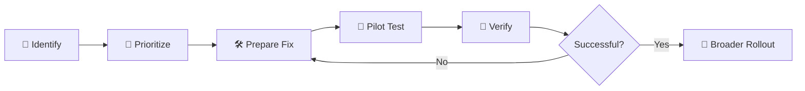

# 📧 Pre-Remediation Coordination | Server Team

### 🌿🐇 Juniper Rabbit Labs

> **Scenario:** Pre-Distribution of Vulnerability Remediation Guidance  
> **Environment:** Juniper Rabbit Labs  
> **Role:** Katy - Vulnerability Management Analyst  
> **Stakeholder:** Mike — Server Team Manager  
> **Phase:** Remediation Planning & Pilot Testing  
> **Objective:** Coordinate pilot testing of proposed remediation actions before broader deployment

---

## 🔄 Remediation Distribution Strategy

> [!IMPORTANT]
> Remediation guidance will be validated against the designated pilot server
> before any changes are recommended for broader deployment.

---

## ✉️ Email to Server Team

**To:** Mike — Server Team Manager  
**From:** Katy — Vulnerability Management Analyst  
**Subject:** Ready for Pilot Testing - Server Remediation Package

Hi Mike,

I've finished reviewing the findings from our initial server assessment and have the first remediation items ready for pilot testing.

Rather than distributing these changes across the server environment immediately, I'd like to use the same pilot server from our initial assessment to test each change first. This will give us a chance to confirm the remediations work as expected, make sure the server remains stable, and identify any issues before we consider a broader rollout.

The current remediation package includes guidance for:

- Outdated third-party software
- Guest account configuration
- SMB signing
- RDP Network Level Authentication
- Legacy authentication settings
- Windows patching

The remediation package, including commands, scripts, and validation steps, will be maintained here:

➡️ **[Server Remediation Package](PUT LINK TO REMEDIATION PACKAGE HERE)**

For the pilot, I'd like the Server Team to confirm that:

- The remediation completes successfully
- Required services remain operational
- No unexpected application or connectivity issues occur
- Configuration changes persist after restart where applicable
- The server is ready for a verification scan

Once the pilot changes are complete, I'll run another authenticated Tenable scan and compare the results against our initial baseline.

If the targeted findings are no longer detected and the server remains stable, we can use the pilot results to plan a broader deployment.

Let me know if your team sees any concerns with the proposed changes before testing begins.

Thanks!

**Katy**  
Vulnerability Management Analyst  
**Juniper Rabbit Labs** 🌿

---

## 📦 Remediation Package

The remediation package will be updated as each remediation is tested and validated during the project.

| Remediation Area | Pilot Status | Guidance | Verification |
|---|---|---|---|
| Third-Party Software | ⏳ Pending | [Add Script] | [Add Results] |
| Guest Account Configuration | ⏳ Pending | [Add Commands] | [Add Results] |
| SMB Signing | ⏳ Pending | [Add PowerShell] | [Add Results] |
| RDP / Network Level Authentication | ⏳ Pending | [Add PowerShell] | [Add Results] |
| Legacy Authentication | ⏳ Pending | [Add Command] | [Add Results] |
| Windows Patching | ⏳ Pending | [Add Procedure] | [Add Results] |

> [!NOTE]
> Windows Update was paused during creation of the vulnerable lab server.
> The baseline assessment indicated that the underlying automatic update
> policy remained enabled. Remediation documentation will therefore reflect
> the actual update state observed during testing rather than treating the
> system as having Automatic Updates disabled at the policy level.

---

## 🎯 Pilot Success Criteria

A remediation will be considered successfully validated when:

- The intended security change has been applied
- The affected service or system remains operational
- Local validation confirms the expected configuration
- A subsequent authenticated scan confirms the targeted vulnerability is no longer detected

Successful pilot testing does **not** automatically authorize organization-wide deployment. Broader rollout will be coordinated with the Server Team based on the results of the pilot.

---

## ⏭️ Next Phase

**Pilot Remediation & Verification**

The prioritized remediation actions will now be applied to the designated pilot server and validated through authenticated rescanning.