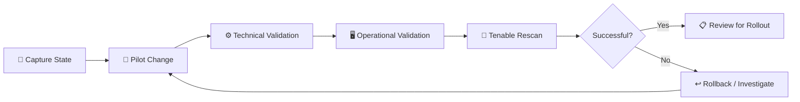

# 🏛️ Change Advisory Board | Pilot Remediation Review

### 🌿🐇 Juniper Rabbit Labs

> **Meeting:** Change Advisory Board - Vulnerability Remediation Review  
> **Environment:** Juniper Rabbit Labs  
> **Change Type:** Security Remediation / Server Configuration  
> **CAB Facilitator:** Jennifer  
> **Vulnerability Management Analyst:** Katy  
> **Server Team Manager:** Mike  
> **Lead Systems Engineer:** Marcus  
> **Objective:** Review the proposed pilot remediation changes, operational risks, testing plan, and rollback strategy before implementation

---

## 📋 Change Request

The Vulnerability Management team is requesting approval to begin a controlled
pilot remediation of findings identified during the initial authenticated
assessment of the Windows Server environment.

### Proposed Pilot Changes

| Change                                   | Reason                                                           | Initial Approach                                     |
| ---------------------------------------- | ---------------------------------------------------------------- | ---------------------------------------------------- |
| Remove unsupported Wireshark 2.2.1       | Multiple Critical, High, and Medium findings                     | Remove from pilot server after dependency validation |
| Remove unnecessary Guest privileges      | Reduce unnecessary administrative access                         | Remove privileged membership / disable account       |
| Require SMB signing                      | SMB signing currently not required                               | Restore secure SMB configuration                     |
| Require RDP Network Level Authentication | NLA currently not enforced                                       | Restore NLA requirement                              |
| Harden legacy authentication             | Weak LAN Manager configuration identified during baseline review | Restore secure authentication configuration          |

> [!IMPORTANT]
> Changes are proposed for the **pilot server only** at this stage.
> Broader deployment requires successful testing and verification.

---

# 💬 CAB Discussion

### 👩‍💼 Jennifer — CAB Facilitator

> Thanks, everyone. We're reviewing the vulnerability remediation change for the Server Team pilot today.
>
> Katy, can you start with what we're changing and why this needs to come through CAB?

### 👩‍💻 Katy — Vulnerability Management Analyst

> Absolutely.
>
> Our initial authenticated Tenable assessment identified 24 reportable vulnerabilities on the pilot server — 4 Critical, 8 High, 11 Medium, and 1 Low.
>
> A large portion of those findings trace back to an unsupported Wireshark 2.2.1 installation. We also identified server configuration issues including SMB signing not being required and RDP operating without Network Level Authentication.
>
> Rather than making all of the changes at once or distributing them broadly, I'm proposing a controlled remediation on the pilot server first.

### 👩‍💼 Jennifer

> What's the risk if we leave the current configuration as-is?

### 👩‍💻 Katy

> The most concentrated risk is the unsupported software.
>
> Wireshark 2.2.1 is generating findings across multiple severity levels, including Critical findings. Because the version is no longer supported, we can't rely on normal vendor security updates to maintain it.
>
> The configuration findings are different. SMB signing and NLA are security controls rather than obsolete applications. Restoring those controls reduces exposure without requiring us to replace the operating system or application stack.

### 🧑‍💻 Marcus — Lead Systems Engineer

> Removing Wireshark doesn't concern me much if we've confirmed nothing depends on it.
>
> I'm more interested in the configuration changes. What happens if requiring SMB signing affects an older client or service that expects the current configuration?

### 👩‍💻 Katy

> That's exactly why I'm proposing the pilot rather than a broad deployment.
>
> We'll capture the current configuration before making the change, apply it to the pilot, validate SMB connectivity, and monitor for unexpected behavior.
>
> We won't use the absence of an error message as proof that the remediation worked. We'll validate the configuration locally and then use the follow-up Tenable scan as independent verification.

### 🧑‍💻 Marcus

> And what's the rollback plan?

### 👩‍💻 Katy

> Each configuration change will have its original value documented before modification.
>
> For registry-backed settings, we'll maintain the previous value and a corresponding rollback command. For the SMB and RDP changes, we'll capture the existing configuration before applying the secure setting.
>
> If the pilot produces a service or connectivity issue, the affected change can be reverted without rolling back unrelated remediations.

### 🧑‍💻 Marcus

> That's important. I'd rather have individual rollback points than one large script that reverses everything.

### 👩‍💻 Katy

> Same here.
>
> I'm deliberately separating the changes so we can tell which remediation caused an issue if something behaves unexpectedly.

### 🖥️ Mike — Server Team Manager

> From the operations side, the initial vulnerability scan didn't cause any noticeable stability problems on the pilot.
>
> My concern now is avoiding a situation where we harden five things simultaneously, restart the server, and then have no idea which change caused a problem.

### 👩‍💻 Katy

> Agreed.
>
> My proposed sequence is staged.
>
> First we'll handle the unsupported third-party software. Then we'll move through the server configuration changes in controlled groups, validating the system between stages.
>
> Each stage gets its own verification scan so we can compare it against the original baseline.

### 👩‍💼 Jennifer

> What about patching? Is that included in this change request?

### 👩‍💻 Katy

> I want to keep that slightly separate.
>
> During creation of the vulnerable server, Windows Update was paused using the maximum pause period available in the current interface. Our Tenable compliance results still showed the underlying automatic-update policy as enabled.
>
> So I don't want the CAB record to describe this as "re-enabling Automatic Updates" when that isn't what our evidence shows.
>
> We'll resume update activity and apply applicable updates during remediation, but we'll document the actual state rather than treating it as a policy change that didn't occur.

### 🧑‍💻 Marcus

> I like that distinction. A paused update schedule and a disabled update policy aren't the same change.

### 👩‍💼 Jennifer

> What about the two Critical libcurl findings from the scan? Are those part of this request?

### 👩‍💻 Katy

> They're being tracked, but I'm not proposing a standalone libcurl change until we've established which installed component is responsible for them.
>
> I don't want us changing or removing a shared library based solely on the plugin title.
>
> If removing the unsupported Wireshark installation also removes the affected component, the rescan will show us that. If the findings remain, we'll investigate the dependency and create a separate remediation action.

### 🧑‍💻 Marcus

> That's the approach I'd prefer. Don't manually replace a library until we know what owns it.

### 🖥️ Mike

> Agreed.

### 👩‍💼 Jennifer

> Let's talk validation. What tells us this pilot succeeded?

### 👩‍💻 Katy

> Three things.
>
> First, **technical validation** — the expected configuration is present after the change.
>
> Second, **operational validation** — the server remains stable and the Server Team confirms the required services and connectivity still work.
>
> Third, **security validation** — an authenticated Tenable rescan confirms that the targeted findings are no longer detected.
>
> I want all three before recommending broader deployment.

### 👩‍💼 Jennifer

> And if one fails?

### 👩‍💻 Katy

> We stop that remediation path, roll back the affected change if necessary, document what happened, and reassess it before attempting wider deployment.
>
> A successful script execution by itself won't count as a successful remediation.

### 🧑‍💻 Marcus

> That's my main concern addressed.
>
> These are mostly manageable changes individually. The risk comes from pushing them together without understanding dependencies. Pilot first, separate rollback points, and validation between stages makes sense from engineering.

### 🖥️ Mike

> Server Team is comfortable supporting that. We'll monitor the pilot during the changes and flag anything abnormal before Katy runs the verification scans.

### 👩‍💼 Jennifer

> Okay. I'm approving the pilot with conditions.
>
> Keep the scope to the designated server, document the pre-change state, maintain a rollback method for each configuration change, and complete technical and operational validation before anything moves toward wider deployment.
>
> Any unexpected impact comes back through the change process before expansion.

### 👩‍💻 Katy

> Works for me. I'll document the remediation evidence and scan results as we move through each stage.

---

# ✅ CAB Decision

> [!NOTE]
>
> ### **Pilot Change: APPROVED WITH CONDITIONS**
>
> The CAB approved remediation testing on the designated pilot server.
> Approval does **not** authorize organization-wide deployment.

### Approval Conditions

- [x] Limit initial changes to the designated pilot server
- [x] Capture relevant pre-change configuration
- [x] Maintain individual rollback procedures
- [x] Validate server functionality after remediation
- [x] Perform authenticated Tenable verification scans
- [x] Investigate unresolved Critical findings before broader rollout
- [x] Return unexpected operational impact to CAB for review

---

## 🔄 Approved Change Path

---

## 🛡️ Rollback Strategy

Configuration changes will be treated as **independent change units**.

Rather than relying on a single all-or-nothing rollback script, the original
configuration for each affected control will be documented so an individual
change can be reversed if unexpected behavior occurs.

This approach limits the blast radius of remediation and makes it easier to
identify which change caused an operational issue.

---

## ⏭️ Next Phase

**Pilot Remediation → Validation → Authenticated Rescan**
