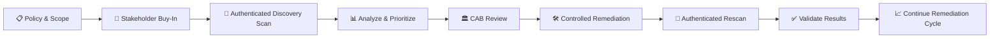
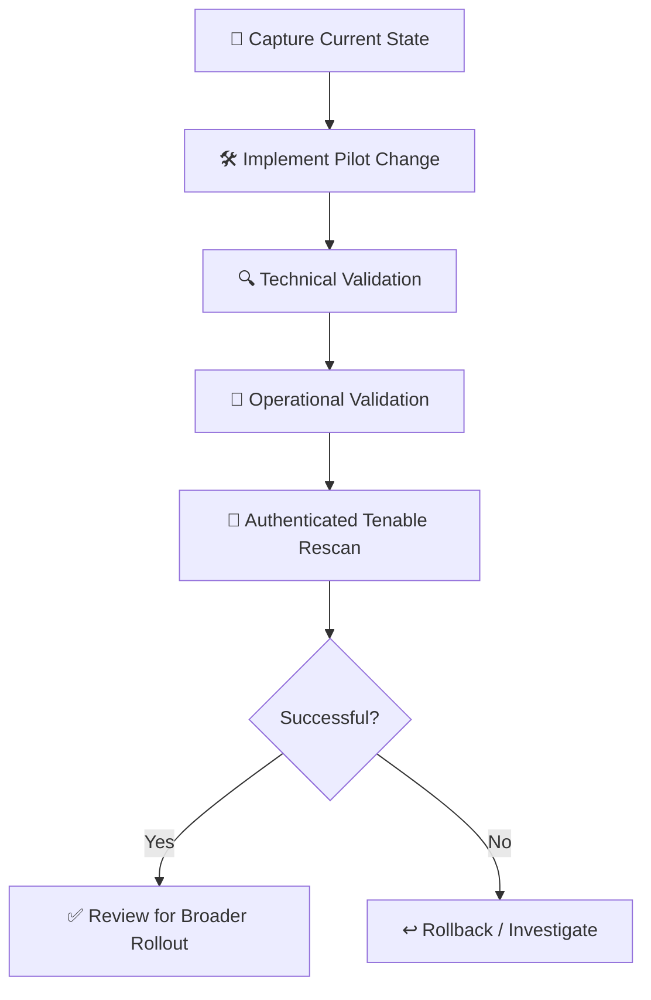

# 🌿 Vulnerability Management Program — Juniper Rabbit Labs

> **Project Type:** Vulnerability Management / Security Operations  
> **Environment:** Microsoft Azure | Windows Server 2025  
> **Primary Tool:** Tenable Vulnerability Management  
> **Role:** Vulnerability Management Analyst

---

## 🐇 Project Overview

This project simulates the implementation of a vulnerability management program for **Juniper Rabbit Labs**, an organization operating a Windows Server environment in Microsoft Azure.

The project follows the vulnerability management lifecycle from initial stakeholder engagement and policy development through authenticated vulnerability scanning, remediation planning, Change Advisory Board (CAB) review, technical remediation and validation.

The initial authenticated Tenable scan identified **24 reportable vulnerabilities**, including **4 Critical, 8 High, 11 Medium and 1 Low severity findings**.

Remediation was performed incrementally, with authenticated rescans used after each change to validate the results.

During the project, two unexpected Critical vulnerabilities associated with an outdated Microsoft EdgeCore component were also discovered. These findings were not intentionally introduced as part of the lab and required independent investigation and remediation.

### Final Result

**24 → 3 reportable vulnerabilities**

**87.5% reduction in reportable vulnerabilities**

**4 Critical → 0 Critical**

**8 High → 0 High**

The remaining findings consisted of two certificate-related findings and one Low-severity ICMP timestamp disclosure.

---

## 🛠️ Technologies & Tools

| Technology                           | Use                                                                  |
| ------------------------------------ | -------------------------------------------------------------------- |
| **Tenable Vulnerability Management** | Authenticated vulnerability and configuration scanning               |
| **Microsoft Azure**                  | Hosting the Windows Server lab environment                           |
| **Windows Server 2025**              | Vulnerability assessment and remediation target                      |
| **PowerShell**                       | Configuration changes, validation and remediation                    |
| **CIS Benchmarks**                   | Secure configuration and compliance validation                       |
| **Windows Registry**                 | Validation and remediation of selected security settings             |
| **Microsoft Edge Update / Repair**   | Vendor-supported remediation of an unexpected EdgeCore vulnerability |
| **GitHub**                           | Project documentation and portfolio evidence                         |
| **Mermaid**                          | Workflow and remediation lifecycle visualization                     |

---

## 🔄 Vulnerability Management Lifecycle



---

# 📋 Phase 1 — Policy & Stakeholder Engagement

Before vulnerability scanning began, a vulnerability management policy and remediation process were developed for Juniper Rabbit Labs.

The proposed program established expectations for scanning, remediation timelines, stakeholder responsibilities, maintenance windows, exceptions and ongoing review.

Server Team Manager **Mike** was consulted before implementation to ensure that the proposed vulnerability management process could be supported operationally.

### 🤝 Stakeholder Meeting — Server Team Buy-In

📄 [View Server Team Policy Buy-In Meeting](./01-policy-servermgr-buy-in.md)

This meeting focused on reviewing the proposed vulnerability management policy, discussing operational concerns and obtaining Server Team feedback before implementation.

---

# 🔎 Phase 2 — Initial Discovery Planning

Following stakeholder buy-in, the Server Team was engaged to plan the first authenticated vulnerability scan.

Rather than immediately scanning the full environment, the initial approach focused on a controlled server assessment to evaluate scanner behavior, credential requirements, resource utilization and potential operational impact.

### 🖥️ Server Team Meeting — Initial Discovery Scan

📄 [View Initial Discovery Scan Meeting](./02-servermgr-initial-discovery.md)

The meeting covered:

- Authenticated vulnerability scanning
- Administrative credential requirements
- Expected scan traffic
- Potential server resource utilization
- Initial limited-scope testing
- Credential lifecycle and deprovisioning

---

# 🔍 Phase 3 — Initial Authenticated Vulnerability Scan

An authenticated Tenable scan was performed against the Windows Server 2025 VM.

After informational findings were filtered out, the baseline identified:

| Severity    | Findings |
| ----------- | -------: |
| 🔴 Critical |    **4** |
| 🟠 High     |    **8** |
| 🟡 Medium   |   **11** |
| 🟢 Low      |    **1** |
| **Total**   |   **24** |


Key findings included:

- Unsupported Wireshark 2.2.1 installation
- Multiple vulnerabilities associated with the unsupported Wireshark installation
- Two Critical libcurl vulnerabilities
- SMB signing not required
- RDP Network Level Authentication not required
- Weak LAN Manager authentication configuration
- Guest account configuration issues
- SSL certificate findings
- ICMP timestamp disclosure

📄 **[Initial Windows Server Baseline — Executive Summary](https://drive.google.com/file/d/1KljyY0-N7LDKYGj1hbRrda7KksuJzbuo/view?usp=sharing)**

---

# 📨 Phase 4 — Remediation Planning

Results from the initial scan were reviewed and grouped by common root cause rather than treating every scanner finding as an independent remediation task.

This was particularly important for the unsupported Wireshark installation, which generated numerous Critical, High and Medium findings from a single outdated software dependency.

### ✉️ Pre-Remediation Communications

📄 [View Pre-Remediation Emails](./03-preremediation-emails.md)

### 🤝 Server Team Post-Scan Review

📄 [View Post-Initial Scan Meeting](./04-servermgr-post-initial-scan.md)

The post-scan review focused on:

- Prioritizing findings by severity and root cause
- Separating software vulnerabilities from configuration findings
- Evaluating operational impact
- Identifying remediation ownership
- Preparing proposed changes for CAB review

---

# 🏛️ Phase 5 — Change Advisory Board Review

Before remediation changes were implemented, the proposed pilot changes were reviewed through a simulated Change Advisory Board process.

Participants included:

- **Jennifer** — CAB Facilitator
- **Katy** — Vulnerability Management Analyst
- **Mike** — Server Team Manager
- **Marcus** — Lead Systems Engineer

The CAB reviewed the proposed changes, validation requirements, rollback considerations and operational risks before approving the pilot remediation cycle.

📄 [View CAB Remediation Review](./05-cab-remediation-review.md)

### CAB Change Workflow



---

# 🛠️ Phase 6 — Remediation & Validation

Remediation was performed incrementally. After each major change, the server was restarted when appropriate and rescanned using the same authenticated Tenable assessment.

This allowed each remediation to be validated before moving to the next change.

---

## 🔄 Remediation #1 — Windows OS Update

The first remediation round focused on Windows OS updates and update configuration.

Available Windows updates were applied and automatic update settings were explicitly configured. The server was then restarted and rescanned.

The primary Windows Update controls evaluated during the original assessment were already compliant, so this remediation did not produce a significant reduction in the reportable vulnerability count. Instead, the remediation validated the update configuration and ensured the server was configured to continue receiving updates.

### Actions

- Installed available Windows updates
- Configured automatic Windows Update settings
- Verified update configuration
- Restarted the server
- Performed an authenticated Tenable rescan


📄 [Scan 01 — Windows OS Update Remediation — Full Report](https://drive.google.com/file/d/1rgwQdtksUejBtI2a69NBKx3cTtxZSmJG/view?usp=sharing)

---

## 👤 Remediation #2 — Guest Account Hardening

The second remediation round addressed unnecessary privileged access associated with the local Guest account.

The Guest account was removed from the local Administrators group and disabled.

Following remediation, the server was restarted and rescanned. The resulting CIS audit confirmed that the Guest account status was set to **Disabled**, validating the intended configuration change.

### Actions

- Removed Guest from the local Administrators group
- Disabled the local Guest account
- Restarted the server
- Performed an authenticated Tenable rescan
- Validated the applicable CIS Guest account control


📄 [Scan 02 — Windows Secure Configuration — Guest Account Remediation — Full Report](https://drive.google.com/file/d/1XV4wlJnjlzFEMYRP0UrIMpehPnDEsqRk/view?usp=sharing)

---

## 📦 Remediation #3 — Unsupported Third-Party Software

The baseline scan identified numerous vulnerabilities associated with an unsupported installation of **Wireshark 2.2.1**.

Rather than treating each Wireshark vulnerability as an independent remediation task, the findings were grouped around their common root cause: the obsolete software installation.

Wireshark and its associated components were removed from the server before another authenticated scan was performed.

### Result

|           | Before | After |
| --------- | -----: | ----: |
| Critical  |      4 | **2** |
| High      |      8 | **0** |
| Medium    |     11 | **4** |
| Low       |      1 | **1** |
| **Total** | **24** | **7** |


> [!IMPORTANT]
> Removing one unsupported application eliminated **17 of the original 24 reportable findings — approximately 71% of the original vulnerability exposure.**

This demonstrated the value of grouping vulnerability findings by **root cause and remediation action** rather than relying only on raw scanner counts.

📄 [Scan 03 — Third-Party Software Removal — Executive Summary](https://drive.google.com/file/d/1KBNDIAxLseQ8xRGhmpv2csuLst8o0uhU/view?usp=sharing)

---

## 🔐 Remediation #4 — SMB Signing

The next remediation addressed the finding **SMB Signing not required**.

SMB signing was restored to strengthen the integrity of SMB communications and reduce exposure to attacks involving unsigned SMB traffic.

The configuration change was validated through another authenticated Tenable scan.


### Result

**7 → 6 reportable vulnerabilities**

The **SMB Signing not required** finding was no longer detected.

📄 [Scan 04 — Re-enable SMB Signing — Executive Summary](https://drive.google.com/file/d/1gFJHZs9oTwlB-MPRwE47lZ8z4rMakY_0/view?usp=sharing)

---

# ⭐ Remediation #5 — Critical EdgeCore / libcurl Investigation

> [!NOTE]
> **Independent Finding:** These Critical vulnerabilities were not intentionally introduced as part of the lab. They were discovered during authenticated scanning and required additional investigation beyond the planned remediation steps.

Following removal of the unsupported Wireshark installation, two Critical vulnerabilities remained:

- **libcurl Negotiate Ambient User Connection Reuse**
- **libcurl HTTP/2 Server Push Use-After-Free**

Both findings were associated with a vulnerable **libcurl 8.21.0** component located under an older Microsoft EdgeCore installation.

### 🔎 Investigation

Tenable identified the vulnerable library under:

```text
C:\Program Files (x86)\Microsoft\EdgeCore\
152.0.4191.66\undocked_copilot\libcurl.dll
```

Further investigation found two EdgeCore versions present:

```text
152.0.4191.66
154.0.4258.53
```

Microsoft Edge and the Microsoft Edge WebView2 Runtime were then checked through their registered Edge Update configuration.

Both current applications were registered as:

```text
154.0.4258.53
```

The active WebView2 runtime was also located under version `154.0.4258.53`.

A process/module check found no running process loading components from the older `152.0.4191.66` EdgeCore directory.

### Root Cause

The investigation indicated that the current Microsoft Edge and WebView2 components had already been updated, but a **superseded EdgeCore version containing the vulnerable libcurl library remained on disk**.

Rather than manually deleting the directory or replacing the DLL, the owning application and its servicing state were investigated to identify a vendor-supported remediation path.

### 🛠️ Remediation

The registered Microsoft Edge and WebView2 **online repair mechanisms** were used.

Following repair and reboot, the obsolete EdgeCore version was removed automatically.

**Before:**

```text
EdgeCore\
├── 152.0.4191.66    ← vulnerable libcurl 8.21.0
├── 154.0.4258.53    ← current
├── Optimized
└── PlatformExperiencesHelper
```

**After:**

```text
EdgeCore\
├── 154.0.4258.53
├── Optimized
└── PlatformExperiencesHelper
```

### ✅ Validation

An authenticated Tenable rescan confirmed that both Critical libcurl findings were no longer detected.

|           | Before | After |
| --------- | -----: | ----: |
| Critical  |  **2** | **0** |
| High      |      0 |     0 |
| Medium    |      3 |     3 |
| Low       |      1 |     1 |
| **Total** |  **6** | **4** |


> [!TIP]
> This remediation demonstrated why scanner findings still require analyst investigation. The vulnerable binary existed on disk even though the currently registered applications had already been updated.

📄 [Scan 05 — EdgeCore / libcurl Remediation — Executive Summary](https://drive.google.com/file/d/1S5oQ4rnqihSSVAcwdae0_WLLVooOCLuD/view?usp=sharing)

---

## 🖥️ Remediation #6 — RDP Network Level Authentication

The next remediation addressed Remote Desktop Services operating without a requirement for **Network Level Authentication (NLA)**.

NLA was re-enabled on the Windows Server and the configuration was verified before performing another authenticated scan.


### Result

**4 → 3 reportable vulnerabilities**

The **Terminal Services Doesn't Use Network Level Authentication (NLA) Only** finding was no longer detected.

📄 [Scan 06 — Re-enable RDP NLA — Executive Summary](https://drive.google.com/file/d/1Ky2ArCfPlGxz0tx8Lb56D3P43Pttb9QX/view?usp=sharing)

---

## 🔑 Remediation #7 — LAN Manager Authentication

The final planned configuration remediation restored stronger LAN Manager authentication settings after weak authentication had been intentionally configured for the lab.

The LAN Manager authentication level was restored to **Send NTLMv2 response only. Refuse LM & NTLM**, preventing the system from using the weaker LM and NTLM authentication protocols.

Another authenticated Tenable assessment was then performed to validate the change. The post-remediation compliance assessment **PASSED** the LAN Manager authentication check, confirming that the stronger authentication configuration had been successfully restored.

This remediation did not reduce the Executive Summary vulnerability count because the setting was evaluated through the configuration/compliance assessment rather than as an additional reportable vulnerability. The successful audit result nevertheless provided direct validation that the remediation was effective.


📄 [Scan 07 — Restore LAN Manager Authentication — Full Export](https://drive.google.com/file/d/1S20vyGNFjb2jBItbP4j6gu6AxgRsTVDp/view?usp=sharing)

---

# 📊 Remediation Heat Map

| Remediation Stage            | 🔴 Critical |  🟠 High | 🟡 Medium |   🟢 Low | **Total** |
| ---------------------------- | ----------: | -------: | --------: | -------: | --------: |
| **Initial Baseline**         |    🔴 **4** | 🟠 **8** | 🟡 **11** | 🟢 **1** |    **24** |
| Windows OS Update            |        🔴 4 |     🟠 8 |     🟡 11 |     🟢 1 |    **24** |
| Guest Account Hardening      |        🔴 4 |     🟠 8 |     🟡 11 |     🟢 1 |    **24** |
| Third-Party Software Removal |        🔴 2 |     ⚪ 0 |      🟡 4 |     🟢 1 |     **7** |
| SMB Signing                  |        🔴 2 |     ⚪ 0 |      🟡 3 |     🟢 1 |     **6** |
| **EdgeCore / libcurl ⭐**    |    **⚪ 0** |     ⚪ 0 |      🟡 3 |     🟢 1 |     **4** |
| RDP NLA                      |        ⚪ 0 |     ⚪ 0 |      🟡 2 |     🟢 1 |     **3** |
| LAN Manager Authentication   |        ⚪ 0 |     ⚪ 0 |      🟡 2 |     🟢 1 |     **3** |

### 📉 Overall Reduction

```text
Initial Scan                                      Final Scan

Critical    ████  4                              Critical             0
High        ████████  8                          High                 0
Medium      ███████████  11                      Medium       ██      2
Low         █  1                                 Low          █       1

TOTAL       24                                   TOTAL                3
```

**Overall vulnerability reduction: 87.5%**

**Critical vulnerabilities eliminated: 100%**

**High vulnerabilities eliminated: 100%**

---

# 🎯 Remediation Outcomes

The first remediation cycle reduced the reportable vulnerability count from **24 to 3**.

### Key Outcomes

- Eliminated all **Critical** vulnerabilities
- Eliminated all **High** vulnerabilities
- Reduced total reportable vulnerabilities by **87.5%**
- Removed an unsupported third-party application responsible for **17 findings**
- Restored SMB signing
- Restored RDP Network Level Authentication
- Restored stronger LAN Manager authentication
- Hardened the local Guest account
- Validated Windows Update configuration
- Independently investigated and remediated two unexpected Critical EdgeCore/libcurl vulnerabilities
- Used authenticated rescanning to validate remediation effectiveness

---

# 🔎 Remaining Findings

At the conclusion of the remediation cycle, three reportable findings remained:

| Severity  | Finding                                       |
| --------- | --------------------------------------------- |
| 🟡 Medium | SSL Certificate Cannot Be Trusted             |
| 🟡 Medium | SSL Self-Signed Certificate                   |
| 🟢 Low    | ICMP Timestamp Request Remote Date Disclosure |

These findings were documented as residual findings at the conclusion of the lab rather than making additional unplanned changes solely to achieve a zero-finding scan.

This reflects an important part of vulnerability management: **the goal is not simply to make the scanner show zero findings, but to identify, prioritize, remediate, validate and appropriately manage remaining risk.**

---

# 📁 Project Artifacts

| Artifact                                                              | Description                                                         |
| --------------------------------------------------------------------- | ------------------------------------------------------------------- |
| [Policy / Server Team Buy-In](./01-policy-servermgr-buy-in.md)        | Stakeholder review of the proposed vulnerability management program |
| [Initial Discovery Scan Meeting](./02-servermgr-initial-discovery.md) | Planning authenticated discovery scanning with the Server Team      |
| [Pre-Remediation Communications](./03-preremediation-emails.md)       | Remediation coordination and stakeholder communications             |
| [Post-Initial Scan Review](./04-servermgr-post-initial-scan.md)       | Review and prioritization of initial vulnerability findings         |
| [CAB Remediation Review](./05-cab-remediation-review.md)              | Change review, pilot approval, validation and rollback planning     |

---

# 🧠 Key Takeaways

This project reinforced that vulnerability management involves more than identifying vulnerabilities with a scanner.

Effective remediation required:

- Communicating with technical stakeholders
- Establishing policy and remediation expectations
- Running authenticated scans
- Separating vulnerability findings from configuration/compliance findings
- Grouping related findings by common root cause
- Prioritizing remediation based on severity and operational impact
- Using change-management practices before implementing security changes
- Validating each remediation through rescanning
- Investigating unexpected findings rather than blindly applying scanner recommendations
- Using vendor-supported remediation methods when possible
- Documenting residual risk rather than forcing a zero-finding result

The unexpected EdgeCore/libcurl findings were particularly valuable because they required investigation beyond the planned lab steps. Although Microsoft Edge and WebView2 were already registered at the current version, a vulnerable superseded component remained on disk and continued to be detected by Tenable.

The issue was resolved through the application's registered repair mechanism rather than manually deleting or replacing application files and the subsequent authenticated scan confirmed that both Critical findings had been eliminated.

---

## 🌿 Juniper Rabbit Labs

_Simulated environment for hands-on vulnerability management and cybersecurity portfolio development._
